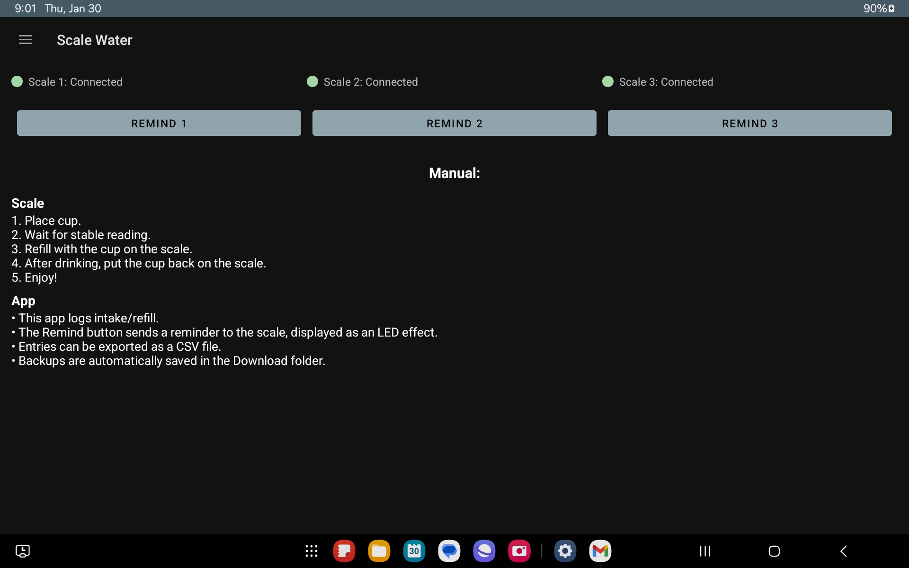
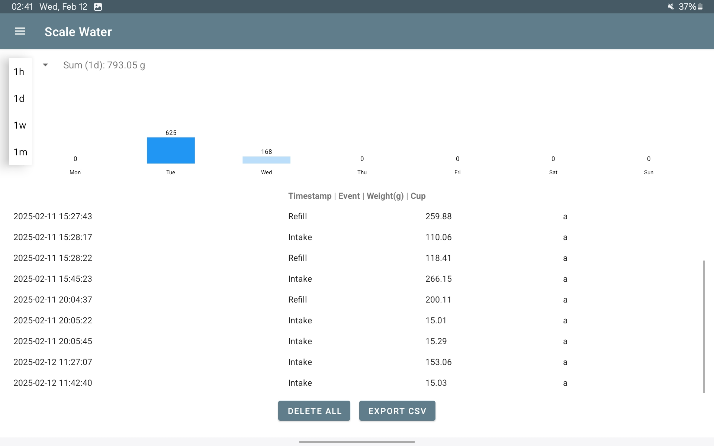
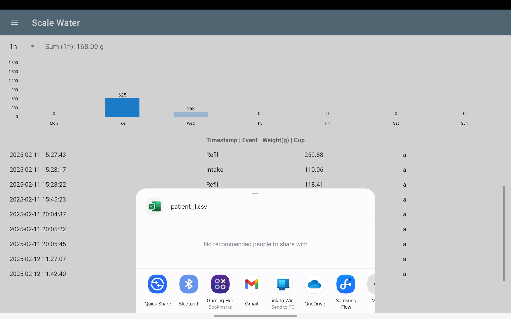
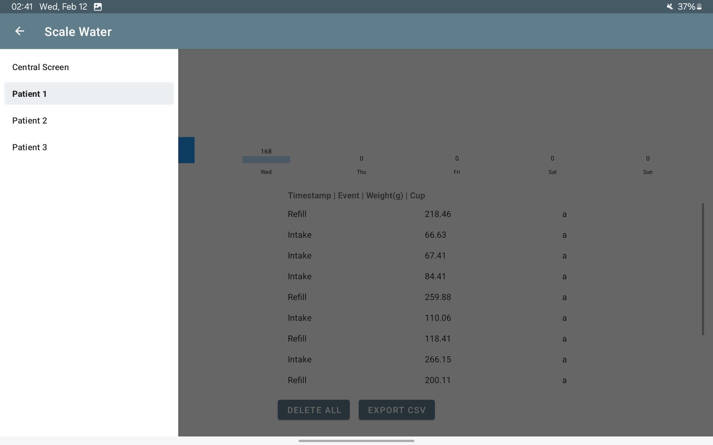
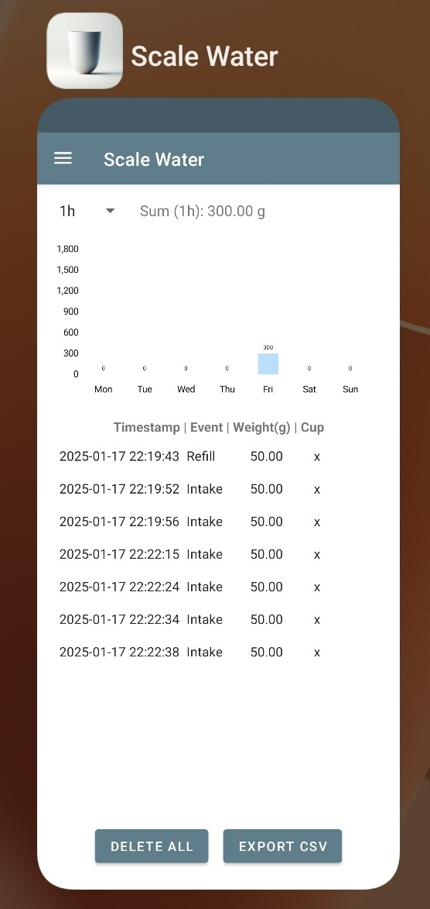

# Smart Coaster – 📱 Android App


[](https://github.com/vladyslavm-dev/smart-coaster-android/actions/workflows/android-ci.yml)

Android companion app for a **BLE-enabled smart coaster** that tracks real-time water intake in a **clinical setting**.  

The app connects to up to **three Bluetooth Low Energy scales in parallel**, aggregates intake events, and presents them as summaries, charts, and CSV exports in an interface designed for effortless use by clinical staff during routine shifts.

Developed as part of my Bachelor’s thesis in Information Systems at TUM.

<table>
  <tr>
    <td align="center">
      <br/>
      <sub>Central overview</sub>
    </td>
    <td align="center">
      <br/>
      <sub>Intake timeframe</sub>
    </td>
    <td align="center">
      <br/>
      <sub>Export CSV</sub>
    </td>
    <td align="center">
      <br/>
      <sub>Patient slider</sub>
    </td>
    <td align="center">
      <br/>
      <sub>Mobile view</sub>
    </td>
  </tr>
</table>

---
## 🔍 Use Case in One Minute
- **Where?**
  - Clinical settings where staff need to monitor patients’ water intake.
- **Hardware?**
  - Custom smart coaster built around an **Arduino Nano 33 BLE**, HX711 load cell and NeoPixel ring.
- **What does the app do?**
  - Connects to **three coasters at once** (three patients per tablet).
  - Receives weight events via BLE (e.g. `I 45.23 a` or `R 32.10 a`).
  - Turns them into **intake / refill events**, daily / weekly sums and a **per-patient history**.
  - Exports all events as **CSV** for later analysis in Excel / R / Python.
- **Why?**
   - On many wards, fluid intake is still noted manually on paper or in loosely structured lists. In practice, this often leads to **under-documented** or **imprecise records** – which is risky in both directions:
      - **Dehydration** (too little intake) – especially critical for older patients or those with infections.  
      - **Overhydration** (too much intake) – can worsen conditions like **heart failure**, **kidney disease**, or **liver cirrhosis**.
---
## 🔑 Key Features
### For Clinical Staff
- **3 Patients Per Tablet**
  - Three independent BLE connections (`Scale_Clinical1/2/3`), each bound to one patient.
  - Connection state shown as **colored dot per scale**:
    - 🟢 Connected  
    - 🔵 Reconnecting  
    - 🔴 Disconnected  
- **Real-Time Intake Overview**
  - Per-patient screen with:
    - Intake/refill event list (timestamp, event type, grams, cup ID).
    - Configurable **summary window**: last 1h / 24h / 7d / 30d.
    - Weekly bar chart (Mon–Sun) with **today highlighted**.
- **Data Export**
  - One-tap **CSV export** per patient:
    - `Timestamp, Event (Intake/Refill), Weight (g), Cup`
  - Export uses `FileProvider` and the Android share sheet (e.g. email to clinic PC).
- **Safety / Robustness**
  - All events are written to **plain text log files** in `Download/Scale Water/patient_X_backup.txt`.
  - On app start, logs are loaded back into memory so data survives:
    - App crashes
    - Device reboot
    - App updates
### For Patients
- Simple mental model: "**Always put the cup back on the coaster**."
- LED feedback on the coaster (via Arduino firmware):
  - **Green wave** on drink event.
  - **Blue wave** on refill.
  - **Red** when cup is missing.
  - **Reminder animation** when staff triggers a "please drink" signal from the app.
    
LED logic is implemented in the Arduino firmware, while the app triggers reminder writes via BLE.

---
## 🗂 Project Structure
```
app/
 ├── java/com/example/thesis/
 │    ├── BackupManager.java
 │    ├── BleDeviceManager.java
 │    ├── BleUuids.java
 │    ├── CSVExporter.java
 │    ├── DataManager.java
 │    ├── MainActivity.java
 │    ├── CentralFragment.java
 │    ├── PatientFragment.java
 │    ├── PatientEventAdapter.java
 │    ├── MySwipeCallback.java
 │    └── WaterEvent.java
 │
 ├── res/
 │    ├── layout/
 │    │    ├── activity_main.xml
 │    │    ├── fragment_central.xml
 │    │    ├── fragment_patient.xml
 │    │    └── list_item_event.xml
 │    ├── menu/activity_main_drawer.xml
 │    ├── drawable/
 │    │    ├── dot_shape_green.xml
 │    │    ├── dot_shape_red.xml
 │    │    └── dot_shape_blue.xml
 │    └── xml/file_paths.xml
 │
 ├── AndroidManifest.xml
 └── build.gradle.kts
```
---
## 🗃 Architecture at a Glance
The app is written in **Java** and uses one Activity with modular **Fragments** for the UI.
### High-Level
- **`MainActivity`**
  - Hosts the navigation drawer and fragment container.
  - Creates one `BleDeviceManager` per scale (3 in total).
  - Handles runtime permission flow for BLE + location.
  - Implements:
    - `CentralFragment.CentralListener` (reminder button)
    - `BleDeviceManager.ConnectionStatusListener` (connection dot updates)
    - `PatientFragment.PatientFragmentListener` (clear-all-backups hook)
- **`CentralFragment`**
  - Landing screen.
  - Shows one line per scale:
    - Colored status dot (`dot_shape_green/red/blue.xml`)
    - Text like `Scale 1: Connected / Reconnecting / Disconnected`
  - Three "Remind patient" buttons → writes a **single byte** to the corresponding scale via BLE.
- **`PatientFragment`**
  - Detail screen for **one patient index (0–2)**.
  - Responsibilities:
    - Shows the **RecyclerView** with all `WaterEvent` items for that patient.
    - Displays a **summary** (1h / 1d / 1w / 1m) as a single number in grams.
    - Renders a **Mon–Sun bar chart** using MPAndroidChart.
    - Provides **"Delete all entries"** (with AlertDialog confirmation).
    - Provides **"Export CSV"**.
### Data & Persistence
  - `DataManager`
    - Singleton that holds three in-memory lists of `WaterEvent` (one per patient). Provides:
        - `addWaterEvent(index, event)`
        - `removeEvent(index, long eventId)`
        - `clearEvents(index)`
        - `getIntakeSumHours(index, hours)`
        - `getIntakeSumDayOffset(index, dayOffset)`
    - Notifies interested UI components via `DataUpdateListener`.
  - `BackupManager`
    - Deals with **.txt backup files** under `Download/Scale Water`.
    - `saveBackup(context, patientIndex)`:
      - Writes `patient_{index+1}_backup.txt` with human-readable lines:
            `timestamp,Intake,245.79,clinical_cup`
      - Maps `"I"/"R"` ↔ `"Intake"/"Refill"` for readability.
    - `readBackupFile(context, patientIndex)`:
      - Reads log lines back into `WaterEvent` objects.
      - Converts `"Intake"/"Refill"` back to `"I"/"R"` so all analytics use a compact event code.
  - `WaterEvent`
    - Domain object: `timestamp`, `type` (`"I"` or `"R"`), `amount` in grams, `cupName`.
    - Generates a **stable `uniqueId`** for each event so RecyclerView can use `setHasStableIds(true)` and swipes stay reliable.
### UI & Interaction
  - `PatientEventAdapter`
    - RecyclerView adapter with stable IDs (`getItemId()` → `WaterEvent.getUniqueId()`).
    - Displays:
      - Timestamp
      - Event type (`"Intake"` / `"Refill"`)
      - Amount formatted with 2 decimals
      - Cup name
  - `MySwipeCallback`
    - `ItemTouchHelper.SimpleCallback` for left/right swipe.
    - Pops a **confirm dialog** before actually deleting.
    - Uses `adapter.deleteEventById(eventId)` to keep the RecyclerView and `DataManager` in sync.
---
## 📡 BLE Protocol & Connection Logic
### UUIDs
BLE constants live in `BleUuids`:
- **Per scale**
  - `SCALE*_SERVICE_UUID`
  - `SCALE*_TX_CHAR_UUID` (notify → Android)
  - `SCALE*_RX_CHAR_UUID` (write → scale)
### Data Format
**From scale → Android** (TX characteristic):
```text
I 45.23 cup_a     # Intake of 45.23 g from cup "a"
R 32.10 cup_a     # Refill of 32.10 g for cup "a"
```
**BleDeviceManager:**
- Scans for devices advertising the given service UUID.
- Connects via GATT and subscribes to the TX characteristic once per connection.
- Filters duplicate notifications that arrive within 500 ms with identical payload.
- Parses BLE strings into `WaterEvent` objects and sends them into `DataManager`.
  
**From Android → scale** (RX characteristic):
- `sendReminder()` writes a single byte `{1}` to trigger the LED reminder animation on the coaster.
### Connection Robustness
- **Automatic reconnect:**
  - If a scale disconnects, the manager schedules a re-scan and auto-reconnect.
- **BT off/on handling:**
  - `BroadcastReceiver` listens to `ACTION_STATE_CHANGED`.
  - On BT OFF → closes GATT and stops scanning.
  - On BT ON → restarts scan for the known service UUID.
---
## ♟️ Tech Stack
### UI
- AndroidX AppCompat
- Material Components
- Fragments + Navigation Drawer
- RecyclerView with swipe-to-delete
### Bluetooth
- Android BLE / GATT APIs
### Charts
- MPAndroidChart for weekly bar chart
### Persistence / Export
- Plain text backup in `Download/Scale Water`
- CSV export via `FileProvider` and share sheet
### Testing
- Unit & instrumentation tests
- JUnit (`ExampleUnitTest`) for pure Java logic.
- Instrumented tests under `androidTest`:
  - Example: verifying `DataManager` integration and package context.
---
## 💻 Getting Started
### Prerequisites
- Android Studio Ladybug or newer
- Java 11 toolchain
- Android SDK 34
- An Android device or emulator running Android 12+
> **Note:** Without the physical scales, you will see all three scales as "Disconnected" and the patient lists will stay empty. That's expected – the app waits for real BLE events.
### Build & Run
1. **Clone the repo:**
   ```bash
   git clone https://github.com/vladyslavm-dev/smart-coaster-android.git
   cd smart-coaster-android
   ```
2. **Open in Android Studio.**
3. **Let Gradle sync finish.**
4. **Run on a device** (recommended) or emulator:
   - Select app configuration.
   - Click ▶️ Run.
5. **On first launch:**
   - Grant BLE and location permissions when asked.
---
## 📦 Third-Party Libraries
This project uses the following libraries:
  - **MPAndroidChart** – charting library for the weekly intake bar chart.
  - **AndroidX & Material Components** – modern UI + appcompat.
  - **JUnit / AndroidX Test / Espresso** – testing stack.
    
 All other logic (BLE reconnection, buffering, backup strategy) is implemented manually.
 
---
## 📟 Companion Firmware (Arduino)
This Android app expects a smart coaster running custom firmware on an **Arduino Nano 33 BLE** with:
- HX711 load cell amplifier
- Load cell for weight sensing
- Adafruit NeoPixel LED ring
- BLE service + characteristics matching the UUIDs in `BleUuids`

  
**Firmware repo (separate):**
➡️ [https://github.com/vladyslavm-dev/smart-coaster-firmware](https://github.com/vladyslavm-dev/smart-coaster-firmware) 

---
## 📜 Possible Extensions
Some ideas that would be natural next steps:
- Migrate persistence from plain-text backup files to a Room (SQLite) database.
- Add per-patient targets (e.g. "1500 g/day") and threshold-based warnings.
- Lightweight admin mode to configure patients (name, cup type).
- Optional demo mode that simulates BLE events.
---
## 📝 License
- MIT License  
- Copyright (c) 2025 Vladyslav Marchenko
---
## 👤 Author
**Vladyslav Marchenko**
- GitHub: [@vladyslavm-dev](https://github.com/vladyslavm-dev)
- Website: [vladyslavm.dev](https://vladyslavm.dev)
---


