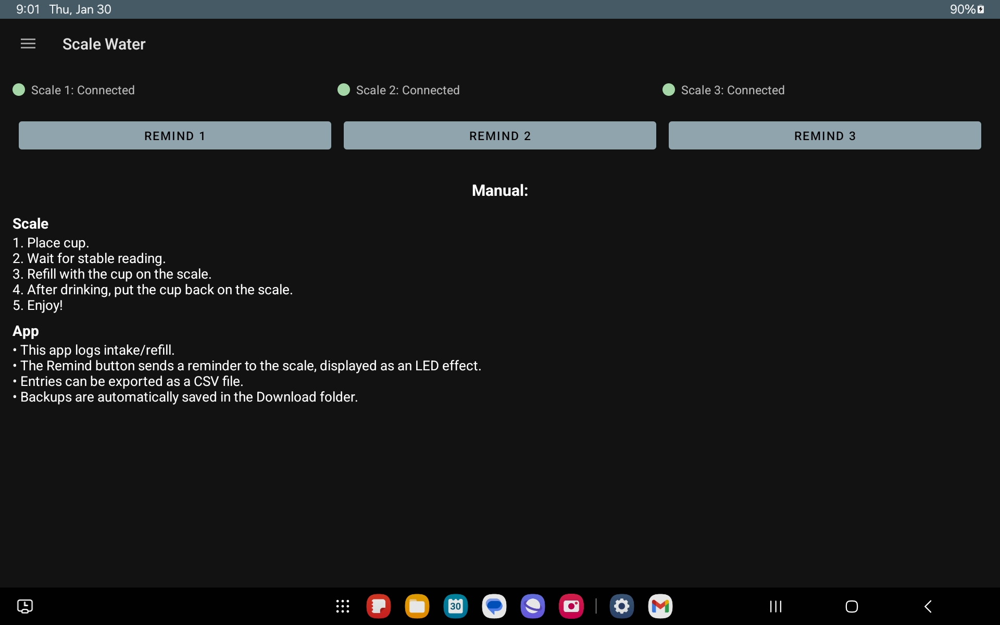
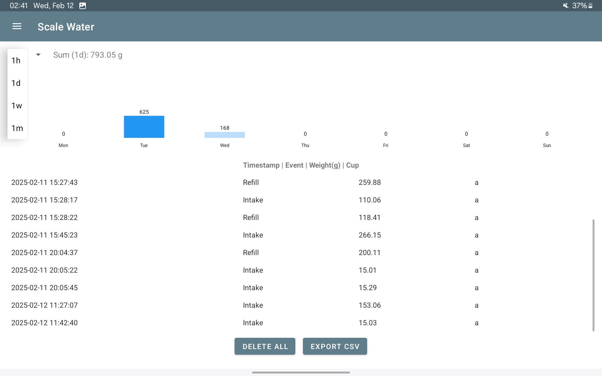
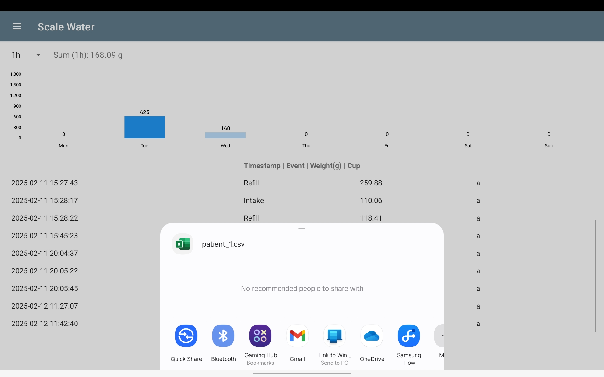
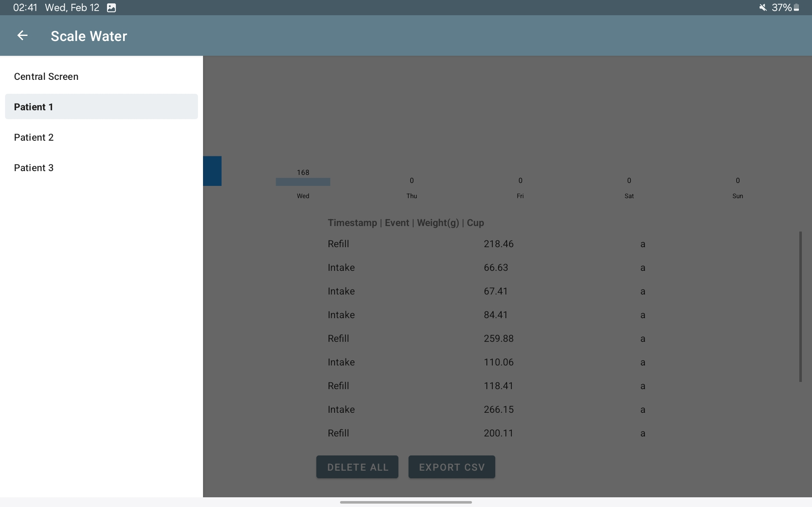
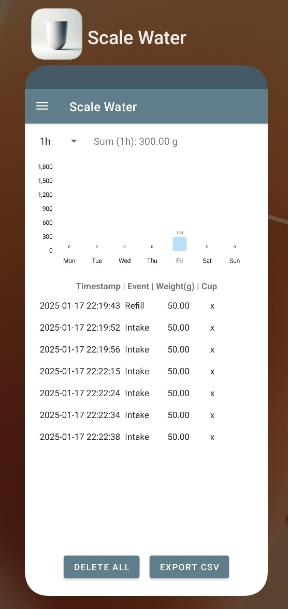

# Smart Coaster – Android App


[](https://github.com/vladyslavm-dev/smart-coaster-android/actions/workflows/android-ci.yml)

Android companion app for a **BLE-enabled smart coaster** that tracks real-time water intake in a **clinical setting**.

The app connects to up to **three Bluetooth Low Energy scales in parallel**, aggregates intake events, and presents them as summaries, charts, and CSV exports in an interface designed for effortless use by clinical staff during routine shifts.

The app was tested by 16 members of the nursing staff within a clinical pilot.

Developed as part of my Bachelor's thesis in Information Systems at TUM. 

<table>
  <tr>
    <td align="center">
      <br/>
      <sub>Central overview</sub>
    </td>
    <td align="center">
      <br/>
      <sub>Intake timeframe</sub>
    </td>
    <td align="center">
      <br/>
      <sub>Export CSV</sub>
    </td>
    <td align="center">
      <br/>
      <sub>Patient slider</sub>
    </td>
    <td align="center">
      <br/>
      <sub>Mobile view</sub>
    </td>
  </tr>
</table>

---

## Use Case

- **Where?** Clinical wards where staff monitor patients' daily fluid intake.
- **Hardware?** Custom smart coaster built around an **Arduino Nano 33 BLE**, HX711 load cell, and NeoPixel LED ring.
- **What does the app do?**
  - Connects to **three coasters simultaneously** (three patients per tablet).
  - Receives weight events via BLE (e.g. `I 45.23 a` for intake, `R 32.10 a` for refill).
  - Aggregates events into **daily / weekly summaries** and a **per-patient history**.
  - Exports all events as **CSV** for analysis in Excel, R, or Python.
- **Why?** On many wards, fluid intake is still documented manually on paper. This leads to imprecise records — risky in both directions:
  - **Dehydration** (too little intake) — critical for elderly patients or those with infections.
  - **Overhydration** (too much intake) — can worsen heart failure, kidney disease, or liver cirrhosis.

---

## Features

### 3 Patients Per Tablet

Three independent BLE connections (`Scale_Clinical1/2/3`), each bound to one patient. Connection state is shown as a colored status dot per scale: green (connected), blue (reconnecting), red (disconnected).

### Real-Time Intake Overview

Per-patient screen with a scrollable event list (timestamp, event type, grams, cup ID), a configurable summary window (last 1h / 24h / 7d / 30d), and a weekly bar chart (Mon–Sun) with today highlighted.

### One-Tap CSV Export

Export per patient via `FileProvider` and the Android share sheet. Format: `Timestamp, Event (Intake/Refill), Weight (g), Cup`. Send directly to a clinic PC via email or any share target.

### Crash-Safe Persistence

All events are written to plain text log files in `Download/Scale Water/patient_X_backup.txt`. On app start, logs are loaded back into memory. Data survives app crashes, device reboots, and app updates.

### Patient-Facing LED Feedback

The coaster provides immediate visual feedback via the NeoPixel ring (controlled by Arduino firmware):
- **Green wave** on drink event
- **Blue wave** on refill
- **Red** when cup is missing
- **Multi-color flash** when staff triggers a "please drink" reminder from the app

### Automatic BLE Reconnection

If a scale disconnects, the manager schedules a re-scan and auto-reconnect. A `BroadcastReceiver` handles Bluetooth on/off events: closes GATT on BT OFF, restarts scanning on BT ON.

---

## Project Structure

```
app/
├── java/com/example/thesis/
│   ├── BackupManager.java          # Plain text backup read/write for crash safety
│   ├── BleDeviceManager.java       # BLE scan, connect, GATT subscribe, reconnect logic
│   ├── BleUuids.java               # Service + characteristic UUIDs (matches firmware)
│   ├── CSVExporter.java            # One-tap CSV export via FileProvider + share sheet
│   ├── DataManager.java            # Singleton: in-memory event lists + time-windowed sums
│   ├── MainActivity.java           # Navigation drawer host, BLE permission flow, 3x managers
│   ├── CentralFragment.java        # Landing: status dots per scale + reminder buttons
│   ├── PatientFragment.java        # Detail: event list, summary, bar chart, export, clear
│   ├── PatientEventAdapter.java    # RecyclerView adapter with stable IDs
│   ├── MySwipeCallback.java        # Swipe-to-delete with confirmation dialog
│   └── WaterEvent.java             # Domain object: timestamp, type, amount, cupName
│
├── res/
│   ├── layout/
│   │   ├── activity_main.xml
│   │   ├── fragment_central.xml
│   │   ├── fragment_patient.xml
│   │   └── list_item_event.xml
│   ├── menu/
│   │   └── activity_main_drawer.xml
│   ├── drawable/
│   │   ├── dot_shape_green.xml     # BLE connection status indicators
│   │   ├── dot_shape_red.xml
│   │   └── dot_shape_blue.xml
│   └── xml/
│       └── file_paths.xml          # FileProvider config for CSV export
│
├── AndroidManifest.xml
└── build.gradle.kts
```

---

## Architecture

The app uses one Activity with modular Fragments and a singleton data layer.

### UI Layer

- **`MainActivity`** — hosts the navigation drawer and fragment container. Creates one `BleDeviceManager` per scale (3 in total). Handles runtime permission flow for BLE + location.
- **`CentralFragment`** — landing screen showing connection status per scale and "Remind patient" buttons that write a single byte to the corresponding scale via BLE.
- **`PatientFragment`** — detail screen for one patient (0–2). Displays the event RecyclerView, time-windowed summary, weekly bar chart (MPAndroidChart), and export/clear actions.

### Data Layer

- **`DataManager`** — singleton holding three in-memory `WaterEvent` lists. Provides `addWaterEvent`, `removeEvent`, `clearEvents`, `getIntakeSumHours`, and `getIntakeSumDayOffset`. Notifies UI components via `DataUpdateListener`.
- **`BackupManager`** — reads/writes `.txt` backup files under `Download/Scale Water`. Maps compact event codes (`I`/`R`) to human-readable labels (`Intake`/`Refill`) for file readability.
- **`WaterEvent`** — domain object with `timestamp`, `type`, `amount` (grams), and `cupName`. Generates a stable `uniqueId` for reliable RecyclerView diffing.

### BLE Layer

- **`BleDeviceManager`** — scans for devices advertising the target service UUID, connects via GATT, subscribes to the TX characteristic for notifications. Filters duplicate payloads within 500ms. Parses BLE strings into `WaterEvent` objects.
- **`BleUuids`** — constants for all three scales: service UUID, TX characteristic (notify → Android), RX characteristic (write → scale).

---

## BLE Protocol

### Data Format

**Scale to Android** (TX characteristic, ASCII):

```text
I 45.23 a     # Intake of 45.23 g from cup "a"
R 32.10 a     # Refill of 32.10 g for cup "a"
```

**Android to Scale** (RX characteristic, 1 byte):

- `0x01` — trigger the reminder LED animation on the coaster.

### Connection Robustness

- Automatic reconnect on disconnect (re-scan + GATT reconnect).
- `BroadcastReceiver` on `ACTION_STATE_CHANGED`: closes GATT on BT OFF, restarts scan on BT ON.
- 500ms deduplication filter to prevent double-counting from noisy BLE notifications.

---

## Tech Stack

| Component | Technology |
|-----------|-----------|
| Platform | Android 12+ (API 31) |
| Language | Java |
| UI | AndroidX AppCompat, Material Components, Fragments + Navigation Drawer |
| Charts | MPAndroidChart (weekly bar chart) |
| Bluetooth | Android BLE / GATT APIs |
| Persistence | Plain text backup files (`Download/Scale Water`) |
| Export | CSV via FileProvider + Android share sheet |
| Testing | JUnit (unit) + AndroidX Test / Espresso (instrumented) |
| Build | Gradle KTS |
| CI | GitHub Actions |

---

## Getting Started

### Prerequisites

- Android Studio 2024.2+
- JDK 17+
- Android SDK 34
- An Android device or emulator running Android 12+

> **Note:** Without the physical smart coasters, all three scales will show as "Disconnected" and the patient event lists will remain empty. The app waits for real BLE events from the hardware.

### Build and Run

1. **Clone the repo:**

   ```bash
   git clone https://github.com/vladyslavm-dev/smart-coaster-android.git
   cd smart-coaster-android
   ```

2. **Open in Android Studio.**

3. **Let Gradle sync finish.**

4. **Run on a device** (recommended) or emulator — select the app configuration and click Run.

5. **On first launch:** grant BLE and location permissions when prompted.

---

## Third-Party Libraries

| Library | Purpose |
|---------|---------|
| **MPAndroidChart** | Weekly intake bar chart |
| **AndroidX + Material Components** | Modern UI + appcompat |
| **JUnit / AndroidX Test / Espresso** | Testing stack |

---

## Companion Firmware

This Android app expects a smart coaster running custom firmware on an **Arduino Nano 33 BLE** with HX711 load cell amplifier and Adafruit NeoPixel LED ring.

Firmware repo: [github.com/vladyslavm-dev/smart-coaster-firmware](https://github.com/vladyslavm-dev/smart-coaster-firmware)

---

## Possible Extensions

- Migrate persistence from plain-text backup files to a Room (SQLite) database.
- Add per-patient intake targets (e.g. "1500 g/day") with threshold-based warnings.
- Lightweight admin mode to configure patients (name, cup type).
- Optional demo mode that simulates BLE events for testing without hardware.

---

## License

MIT License — Copyright (c) 2025 Vladyslav Marchenko

See [LICENSE](LICENSE) for details.

---

## Author

**Vladyslav Marchenko**

- GitHub: [@vladyslavm-dev](https://github.com/vladyslavm-dev)
- Website: [vladyslavm.dev](https://vladyslavm.dev)
